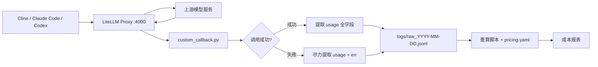

# AI Token 消耗原始记录设计文档

## 1. 设计目标

- 精确记录每次 API 调用的 Token 消耗
- 支持多模型差异化计费（不限厂商，价格由用户自管）
- 支持按工具（Cline / Claude Code / Codex）、按项目（工作区）维度归因
- 失败请求同样记录，确保费用不遗漏

### 1.1 两层分离原则

本设计把数据分成互不污染的两层：

| 层 | 存什么 | 生命周期 | 文件 |
|----|--------|---------|------|
| **事实层** | 请求产生的不可再推导的事实：时间、工具、项目、模型、token 数 | 只追加，永不修改 | `logs/raw_YYYY-MM-DD.jsonl` |
| **规则层** | 人工维护的计价规则：单价、币种、高峰时段、公式 | 可随厂商调价演进 | `pricing.yaml` |

**推论**：

- 原始记录**不存 `cost`**。成本是派生量，由"事实层 + 规则层"重算得出。
- 原始记录**不存单价**。单价属配置，存进每行会造成千倍冗余，且无法追溯其来源版本。
- 原始记录**不承担"查价的键"**。模型名会漂移，查价由 `pricing.yaml` 的映射表负责（见 2.1、3.2）。

这样厂商改价时，只需改 `pricing.yaml` 中对应档位一行，**历史 JSONL 一行都不用动**。

---

## 2. 原始记录字段定义

> **命名说明**：本节所有字段均使用通用占位符（`<provider>/<model>`、`<tier>` 等），
> **不绑定任何具体厂商或模型名**。具体型号与价格由用户自行在 `pricing.yaml` 中配置，见第 3 节。

### 2.1 核心字段（所有模型通用）

| 字段 | 类型 | 必填 | 说明 |
|------|------|------|------|
| `ts` | ISO 8601 字符串 | 是 | 请求发起时间，统一为北京时间（UTC+8），取自 `startTime` |
| `req_id` | string | **否** | 请求唯一标识，取自 `standard_logging_object["id"]`。用于多实例合并后查重（见 5.3） |
| `ok` | bool | 是 | 是否成功。失败请求也必须记录 |
| `key` | string | 是 | 虚拟 Key 别名，取自 `metadata["user_api_key_alias"]`，用于区分来源 |
| `key_hash8` | string | **否** | `user_api_key_hash` 前 8 位。**别名可被用户改名，哈希不可**，作为稳定标识（见 7.1） |
| `user` | string | 否 | 项目名 / 工作区名。取值失败时为 `null` 并置 `partial=true`，见 6.1 |
| `model` | string | 是 | **实际调用的模型标识**，取自 `standard_logging_object["model"]` |
| `in` | int | 是 | 输入 Token 总数，取自 `prompt_tokens`，**口径为"含缓存的全部输入"** |
| `out` | int | 是 | 输出 Token 数，取自 `completion_tokens` |

> **`in` 的口径说明**：LiteLLM 已统一将 `prompt_tokens` 定义为"缓存命中 + 缓存未命中"的输入总量，
> 各 provider 差异已由 LiteLLM 抹平，**callback 不需再做归一化**。
> 计算非缓存输入时必须用 `in - cache_hit - cache_write`。

> **`model` 不作查价主键**：模型名会随厂商改名、别名、下线而漂移，
> 查价改用 `pricing.yaml` 的**模型名 → 档位映射表**（见 3.2）。
> 记录中保留 `model` 是为了留存事实，不是为了查价。

### 2.2 用量扩展字段

| 字段 | 类型 | 必填 | 说明 |
|------|------|------|------|
| `cache_hit` | int | 是 | 缓存命中 / 缓存读取 Token 数。无此概念的模型为 0 |
| `cache_write` | int | **否** | 缓存写入 Token 数。**并非所有厂商都产生**，不产生时不写此字段 |
| `reasoning_tokens` | int | **否** | 思考 Token 数。provider 未提供时不写此字段 |

> **⚠️ 这三个字段不在 `standard_logging_object` 顶层。**
> 它们藏在 `hidden_params["usage_object"]`（备用路径 `metadata["usage_object"]`）里面，
> **且键名因 provider 而异**（Claude 系为 `cache_read_input_tokens` /
> `cache_creation_input_tokens`，DeepSeek 系为 `prompt_cache_hit_tokens`）。
> 提取时必须逐级 `.get()` 并做多键名兼容，见 2.8 的参考实现。
> **不要写成顶层 `.get("cache_hit")`——它永远返回 `None`。**

> **思考模式不等于独立模型**：部分厂商把"思考 / 非思考"作为**同一模型的两种模式**，
> 两者价格相同。因此**不新增"模式"字段**，只按 `reasoning_tokens` 记录用量。
> 若将来厂商对思考模式单独定价，再评估是否新增字段。

### 2.3 模型维度字段

| 字段 | 类型 | 必填 | 说明 |
|------|------|------|------|
| `model_id` | string | **否** | LiteLLM deployment 标识（顶层 `model_id`，备用 `hidden_params["model_id"]`）。同一模型配置多个 Key 轮询时，**仅此字段可区分**，用于排障 |
| `api_base` | string | **否** | 上游地址（顶层 `api_base`，备用 `hidden_params["api_base"]`）。**防止官方直连与第三方中转同模型同价误算**；不外泄时只记 host |

### 2.4 峰值判定（**已改为派生，不存快照**）

> **实现变更说明**：原设计把 `peak` 作为快照写入每行记录。落地时改为**由记录自带的 `ts` 现场推导**，
> 记录中**不再出现 `peak` 字段**。理由见下。

| 项 | 现在怎么做 |
|----|-----------|
| 判据 | 记录的 `ts` + `config/pricing.yaml` 的 `peak_windows` 与 `peak_weekdays` |
| 实现 | `src/pricing.py` 的 `is_peak(ts, tier)`，由 `row_cost()` 调用 |
| 记录字段 | **不写**。事实层只存不可推导的值，可推导的一律不存 |

**为什么不存快照**

原设计担心"规则漂移"：若将来修改高峰时段定义，用新规则重算历史会导致旧记录判断翻转。
这个担心是对的，但**存储快照不是正确的解法**，原因有三：

1. **架构矛盾**：`peak` 依赖 `peak_windows`，而后者在 `pricing.yaml` 里。
   若让 callback 写 `peak`，就必须读价目表——这与 6.3 的"callback 不读配置、导入期安全"直接冲突。
2. **正确性更高**：快照是"写入那一刻的判断"，一旦写错就永久错。
   实测中就出现过样例数据把 17:30（属高峰窗口）标成空闲，而按时间推导能算对。
3. **有更好的机制**：`config/pricing.yaml` **已版本化入库**。要精确复现历史账，
   只要取当时那个版本的价目表即可：

   ```bat
   git checkout <commit> -- config/pricing.yaml
   python recalc.py 2026-09-21
   ```

   这比往每行塞一个快照更可靠，因为它保留了**完整的规则**，而不只是单条判断结果。

**推论**：报表不再信任记录里的任何价格相关字段。记录只有事实（时间、模型、token 数），
价格与峰谷规则全部来自价目表。这也是 1.1 节"两层分离"原则的直接体现。

### 2.5 错误与完整性字段

| 字段 | 类型 | 说明 |
|------|------|------|
| `err` | string \| null | 错误摘要，取自 `error_str`（更结构化时取 `error_information["error_class"]` + `["error_message"]`），截断至 200 字符，须过滤响应体中的密钥。成功时为 null |
| `partial` | bool | **完整性标记**。为 `true` 表示本行存在缺失字段（见 6.2）。正常行不写此字段 |

### 2.6 对照字段

| 字段 | 类型 | 必填 | 说明 |
|------|------|------|------|
| `cost_upstream` | float | **否** | LiteLLM 自算的 USD 成本，**取自 `standard_logging_object["response_cost"]`**。仅作价目表过期哨兵，不参与权威成本计算 |

> **字段名对照**：文档统一使用 `cost_upstream` 作为记录中的键名，
> 其数据来源是 `standard_logging_object["response_cost"]`。
> 若实现时倾向直接用上游原名，也可改叫 `response_cost`，但**全文档与代码必须统一**。

### 2.7 字段统计

| 类别 | 字段数 | 字段 |
|------|--------|------|
| 核心 | 8 | `ts` `req_id` `ok` `key` `key_hash8` `user` `model` `in` `out` |
| 用量扩展 | 3 | `cache_hit` `cache_write` `reasoning_tokens` |
| 模型维度 | 2 | `model_id` `api_base` |
| 计价快照 | 1 | `peak` |
| 对照 | 1 | `cost_upstream` |
| 错误完整性 | 2 | `err` `partial` |
| **合计** | **17** | — |

> **采集成本修正说明**（原文声称"采集成本为零"，**不准确**）：
>
> | 字段 | 采集难度 |
> |------|---------|
> | `ts` / `ok` / `key` / `user` / `req_id` | 需本项目自行推导（`startTime` 转换、`metadata` 逐级取） |
> | `model` / `in` / `out` / `model_id` / `api_base` / `cost_upstream` / `err` | ✅ 顶层字段，单层 `.get()` 即可 |
> | `cache_hit` / `cache_write` / `reasoning_tokens` | ⚠️ **在 `usage_object` 内，且键名因 provider 而异，需多键名兼容** |
> | `peak` | 需本项目按时段规则自行计算 |
>
> 即：**约一半字段不能靠单层 `.get()` 拿到**，2.8 给出统一的提取实现。

### 2.8 字段提取参考实现

以下函数封装了所有"路径不确定 / 键名不确定"的取值，callback 直接调用即可：

```python
def _deep_get(d: dict | None, *keys, default=None):
    """Try multiple key names at one level; return first non-None."""
    if not isinstance(d, dict):
        return default
    for k in keys:
        v = d.get(k)
        if v is not None:
            return v
    return default


def extract_usage(slo: dict) -> dict:
    """Extract cache/reasoning tokens from wherever the provider buried them.

    LiteLLM puts these in hidden_params.usage_object (fallback:
    metadata.usage_object) and the key names differ per provider.
    Never raise - missing means the model does not report it.
    """
    hidden = slo.get("hidden_params") or {}
    meta = slo.get("metadata") or {}
    usage = _deep_get(hidden, "usage_object") or _deep_get(meta, "usage_object") or {}
    if not isinstance(usage, dict):
        usage = {}

    prompt_details = _deep_get(usage, "prompt_tokens_details") or {}
    completion_details = _deep_get(usage, "completion_tokens_details") or {}

    cache_hit = _deep_get(
        usage, "cache_read_input_tokens", "cache_hit_tokens",
        "prompt_cache_hit_tokens", default=None,
    )
    if cache_hit is None:
        cache_hit = _deep_get(prompt_details, "cached_tokens", "cache_hit_tokens")

    cache_write = _deep_get(
        usage, "cache_creation_input_tokens", "cache_write_tokens",
        "cache_creation_tokens", default=None,
    )

    reasoning = _deep_get(usage, "reasoning_tokens", default=None)
    if reasoning is None:
        reasoning = _deep_get(completion_details, "reasoning_tokens")

    return {
        "cache_hit": cache_hit,
        "cache_write": cache_write,
        "reasoning_tokens": reasoning,
    }
```

**调用侧规则**：

| 情形 | 处理 |
|------|------|
| `cache_hit` 为 `None` | 记 0（字段必填，无此概念即 0） |
| `cache_write` 为 `None` | **不写该字段**（不产生缓存写入的正常状态，不算 partial） |
| `reasoning_tokens` 为 `None` | **不写该字段**（不算 partial） |
| `usage_object` 整体取不到，但 `in`/`out` > 0 | 仍写 `partial=true`（说明明细采集失败，而非模型不报） |
| `usage_object` 取不到，且 `in`/`out` 也为 0 | 见 6.2 表首行 |

> `in` / `out` 一律取顶层 `prompt_tokens` / `completion_tokens`，
> **优先于 `usage_object` 内的同名值**（顶层是 LiteLLM 归一化后的结果）。

### 2.9 记录示例

```json
{"ts":"2026-09-21T10:15:03+08:00","req_id":"b980db26-9512-45cc","ok":true,"key":"cline",
 "key_hash8":"a1b2c3d4","user":"wind-forecast","model":"<provider>/<model>",
 "model_id":"<deployment-id>","api_base":"api.example.com",
 "in":12000,"out":800,"cache_hit":11200,"peak":true,"cost_upstream":0.0012}
```

```json
{"ts":"2026-09-21T10:16:40+08:00","req_id":"c4e1f0aa-77b2-41de","ok":false,"key":"codex",
 "user":"paper-visibility","model":"<provider>/<model>",
 "in":0,"out":0,"cache_hit":0,"cache_write":3200,
 "err":"RateLimitError: 429 ...","cost_upstream":0.0004}
```

> **第二个示例说明**：失败请求的 `in`/`out` 是"**尽力提取后仍为 0**"，
> 而非规则规定"必须写 0"。`cache_write` 与 `cost_upstream` 能取到就照常记录——
> 上游在报错前可能**已经产生了计费**，一律清零会系统性低估成本（见第 6 节）。
> 本例中这些字段取到了，故**不标 `partial`**。

---

## 3. 计费规则

本项目的计费规则**全部外置**，且**只提供模板**，具体价格由用户自行填写与维护。

### 3.1 为什么要用户自管价目表

价格取决于**用户自己的渠道**（官方直连 / 第三方中转 / 企业协议价），
项目无法也不应替用户决定。因此：

| 本项目做 | 本项目不做 |
|---------|-----------|
| 提供 `pricing.demo.yaml` 模板（含格式说明与示例） | **不内置任何真实价格** |
| 校验价目表格式是否合法 | **不判断价格数字是否正确** |
| 发现差异时提醒用户自查 | **不自动抓取定价页** |
| 给出官网链接方便核对 | **不自动改写用户的价目表** |

**理由**：项目不为任何价格数字背书；错误的价格比没有价格更危险。

### 3.2 价目表结构：档位 + 映射

价目表分两部分，把"价格"与"模型名"解耦：

```
Part 1  tiers          价格档位：一个档位 = 一套价格
Part 2  model_to_tier  模型名 → 档位 的映射
```

**为什么要分开**：

| 场景 | 效果 |
|------|------|
| 厂商改名，旧名仍可调用 | 只改映射表一行，**历史账不受影响** |
| 多个模型名共用同一价 | 共用一档，**改价只改一处** |
| 同模型不同渠道不同价 | 映射到不同档位，**价格可区分** |

**映射表查不到的模型** → 记入 `unknown_models`，`cost=null`，**绝不静默按 0 计**。

### 3.3 档位字段

| 字段 | 必填 | 说明 |
|------|------|------|
| `currency` | 是 | `CNY` / `USD`。同一张报表内不混币种 |
| `billing` | 是 | `per_token` / `subscription`。订阅制成本记 0，用量照常记录 |
| `peak_windows` | 否 | `[["HH:MM","HH:MM"], ...]`，本地时间，**左闭右开**。**不填 = 全天同一价**，忽略记录中的 `peak` |
| `cache_hit` | 是 | 缓存命中 / 缓存读取单价 |
| `cache_write` | 否 | 缓存写入单价（并非所有厂商都有） |
| `cache_miss` | 否 | 缓存未命中输入单价 |
| `input` | 否 | 输入单价（无缓存概念的模型直接填这个） |
| `output` | 是 | 输出单价 |
| `verified_at` | 是 | 用户核对官网的日期。为空 = 未核对，检查程序会提醒 |
| `source` | 是 | 价格来源链接，便于日后复核 |

单价单位为「元 或 美元 / 百万 token」，支持两种写法：

```yaml
output: 4                  # 固定价
output: {off: 4, peak: 8}  # 峰谷价
```

#### 3.3.1 `peak_windows` 的硬性约束

**禁止跨午夜的窗口**（如 `["22:00","02:00"]`）。

左闭右开的 `[start, end)` 在 `start > end` 时**没有任何时刻能落入区间**，
该窗口会静默失效——不报错，但夜间高价全部按低价算。

需要夜间计价时**拆成两段**：

```yaml
peak_windows:
  - ["22:00", "24:00"]   # ✅ 用 24:00 表示当日终点
  - ["00:00", "02:00"]   # ✅ 次日凌晨另起一段
```

`check_pricing.py` 必须校验：`start < end`，且 `"24:00"` 只允许出现在 `end` 位。

#### 3.3.2 `cache_miss` 与 `input` 的优先级

两者语义重叠（都表示"非缓存输入价"），**同时出现时 `cache_miss` 优先**：

| 档位情形 | 非缓存输入单价 | `cache_hit` 是否必填 |
|---------|--------------|-------------------|
| 只填 `cache_miss` + `cache_hit` | `cache_miss` | 是 |
| 只填 `input`（无缓存概念） | `input` | **否**，缺省视为 0 |
| 两者都填 | `cache_miss`（`input` 被忽略） | 是 |

> **`cache_hit` 的"必填"是有条件的**：仅当档位配置了 `cache_miss` 时才必须填。
> 纯 `input` 档位（如多数无缓存概念的模型）不填 `cache_hit` 属正常，不算格式错误。
> 原文档将 `cache_hit` 无条件列为必填，会迫使这类模型填一个**假的 0.xx 价格**，
> 属于"为了过校验而写错数据"，故在此修正。

### 3.4 重算原则

1. 按记录的 `model` 查**模型名 → 档位**映射表，再取该档位的价格
2. 峰谷判断**直接使用行内 `peak` 快照**，不用 `ts` 重新推断
3. 币种由档位定义，**不在记录行内出现**
4. **不做汇率折算**：报表按币种分开输出，不合并成一个总数
5. `cost_upstream` 仅供对照告警，**不参与权威成本计算**
6. `partial=true` 的行**照常参与计算**，但报表必须**单列数据完整率**（见 3.5）

**两个必须写明的计价口径**：

- **非缓存输入** = `in - cache_hit - cache_write`，下限为 0，
  不可直接用 `in` 乘输入单价，否则缓存部分会被重复计费
- **订阅制模型** 标记 `billing: subscription`，重算时成本记 0 但**保留用量**，
  报表侧单列，避免"总花费"因订阅制而失真

### 3.5 报表必须输出的三张清单

原设计只说"按币种分开输出"，但**没有规定异常数据的呈现方式**。以下三类必须单列，
否则错误会被"总数"掩盖：

| 清单 | 内容 | 为什么必须单列 |
|------|------|--------------|
| `unknown_models` | 映射表查不到的模型名 + 各自的 token 用量 | 若并入总数按 0 计，会漏账且无人察觉 |
| `partial_rows` | `partial=true` 的行数、占比、按 `key` 分布 | 数据完整率下降是**采集出了问题**的信号，比成本数字更重要 |
| `currency_groups` | 按 `currency` 分组的成本小计 | 不同币种**不可相加**（无汇率依据） |

**`currency_groups` 的一致性校验**：同一次运行内，若某档位的 `currency`
与同币种分组内的其他档位一致，则正常；若用户误把 CNY 档位的价格填成 USD 数值，
系统**无法自动发现**（没有汇率依据可交叉验证）。

因此 `check_pricing.py` 只能做一件事：**输出所有档位的 `currency` 一览表供人工复核**，
并在 `pricing.yaml` 的档位定义旁强制要求填写 `source`（来源链接）——
让人能顺着链接回去核对币种。


---

## 4. 数据流设计



> 注意执行顺序：callback 在**上游响应返回之后**触发，不是"先判断时段再转发"。
> `peak` 的判断依据是请求发起时刻 `startTime`，与响应返回时刻无关。

> **失败分支走同一套提取逻辑**：`G` 不是"只取 err"，而是**同样调用 `extract_usage()`**。
> 上游在报错前可能已产生计费（尤其缓存写入），能取到就必须记。
> 仅在确实取不到时，`in`/`out` 才落到 0。

---

## 5. 存储与并发写入方案

### 5.1 部署前置：数据库与虚拟 Key

**LiteLLM 的虚拟 Key 依赖 Postgres，这一条必须先说清。**

`/key/generate` 生成的 Key 与 `key_alias` 都存放在数据库的 `LiteLLM_KeyTable` 中，
**无法在 `config.yaml` 里静态声明**。因此需要：

| 项 | 要求 |
|----|------|
| 数据库 | Postgres（`DATABASE_URL`） |
| 管理密钥 | `general_settings.master_key`，必须以 `sk-` 开头 |
| 初始化 | 首次启动时 LiteLLM 自动建表 |

**签发三个工具 Key 的示例**：

```bash
curl 'http://127.0.0.1:4000/key/generate' \
  -H "Authorization: Bearer $LITELLM_MASTER_KEY" \
  -H 'Content-Type: application/json' \
  -d '{"key_alias": "cline", "metadata": {"tool": "cline"}, "models": ["<model-name>"]}'
```

| 虚拟 Key 别名 | 用途 |
|--------------|------|
| `cline` | Cline |
| `claude` | Claude Code |
| `codex` | Codex |
| `codex--<project>` | Codex 的**单项目专用 Key**（见 7.2 方案二） |

> **不启用数据库的降级路径**：只用 `master_key` 单一密钥也能跑通转发，
> 但**拿不到 `key_alias`**，`key` 字段只能记哈希前 8 位，工具维度归因失效。
> 本项目**不推荐**该路径，仅在"完全不想装数据库"时作为最后手段，
> 此时应在报表中明确标注"工具维度不可用"。

> **`key_alias` 是可变字段**：用户改别名后，历史记录里的旧名字对不上新名字。
> 因此记录中**必须同时保留 `key_hash8`** 作为稳定标识（见 2.1）。
> `key_alias` 用于人读，`key_hash8` 用于机器对账。

### 5.2 存储规格

| 项目 | 规格 |
|------|------|
| 文件格式 | JSONL（每行一条 JSON 记录） |
| 文件分割 | 按天分割，文件名 `raw_YYYY-MM-DD.jsonl` |
| 编码 | UTF-8 |
| 存储路径 | 由环境变量 `AI_GATEWAY_LOG_DIR` 指定；**未设置时默认取 `custom_callback.py` 所在目录下的 `logs/`** |
| 保留策略 | 原始 JSONL 长期保留（按每行约 400 字节、日均 2000 次请求估算，**一年约 290 MB**，磁盘不构成约束） |

> **⚠️ 路径基准必须是 `__file__`，不是 `config.yaml` 的路径。**
>
> 原文写"以 `config.yaml` 所在目录为基准"，但 **callback 根本拿不到 `config.yaml` 的路径**——
> LiteLLM 只把 `custom_callback.py` 作为 Python 模块 import，不会把配置文件路径传给它。
> 正确做法是：
>
> ```python
> BASE_DIR = Path(__file__).resolve().parent
> LOG_DIR = Path(os.environ.get("AI_GATEWAY_LOG_DIR") or (BASE_DIR / "logs"))
> ```
>
> `__file__` 是模块自身位置，**与启动时的 cwd 无关**，
> 因此从任何工作目录启动都能写到正确位置（这正是原文想达到的效果）。
> 只要 `custom_callback.py` 与 `config.yaml` 同目录，两者等价。

**目录结构**：

```
ai-gateway/
├── config.yaml
├── pricing.yaml
├── custom_callback.py
├── logs/
│   ├── raw_2026-09-20.jsonl
│   └── raw_2026-09-21.jsonl
└── token_usage.db          （LiteLLM 自带，备用）
```

### 5.3 并发写入方案

**问题**：LiteLLM 是单进程多协程，多个请求的回调会交替执行。JSONL 追加写若不加保护，
可能出现两行首尾粘连或部分写入，导致**一行损坏后整天的文件后续全部错位**。

**方案（异步锁 + 异步追加）**：

```python
import asyncio, json
from pathlib import Path
import aiofiles
from litellm.integrations.custom_logger import CustomLogger

class UsageLogger(CustomLogger):
    def __init__(self, log_dir: Path):
        self._dir = log_dir
        self._lock = asyncio.Lock()        # 全局单锁：瓶颈是磁盘，分文件加锁无收益

    def _path_for(self, ts) -> Path:
        return self._dir / f"raw_{ts.strftime('%Y-%m-%d')}.jsonl"

    async def _append(self, ts, record: dict) -> None:
        line = json.dumps(record, ensure_ascii=False) + "\n"
        async with self._lock:              # 锁内完成"算文件名 + 写盘"两步
            path = self._path_for(ts)       # 文件名必须在锁内计算，防跨午夜切成两个文件
            async with aiofiles.open(path, "a", encoding="utf-8") as f:
                await f.write(line)
                await f.flush()             # 确保落地，避免进程退出时丢缓冲
```

**三个设计要点**：

| 要点 | 原因 |
|------|------|
| 用 `asyncio.Lock` 而非同步写 | 同步 `open().write()` 会**阻塞事件循环**，写盘期间所有请求一起卡住 |
| **文件名在锁内计算** | 请求 23:59:59 发起、00:00:00 返回时，若两个协程各自算文件名，可能一个算昨天一个算今天 |
| 全局单锁，不分文件 | 单次写约 0.1 ms，**每秒可支撑上万次写入**，对日均千级请求有千倍余量 |

**必须声明的假设**：`asyncio.Lock` **只在本进程内有效**。

- 若同时运行**多个 LiteLLM 实例**（两个进程各占一个端口），进程间锁失效，日志仍会交错
- 应对方式与自动检测机制见 5.3，**用户无需自行判断"算不算多实例"**

> **重要澄清**：以下情形**都不是**多实例，`asyncio.Lock` 完全足够，无需任何额外配置：
> - 同时开**多个项目 / 工作区**（`user` 不同）
> - 同时使用**多个模型**（`model` 不同）
> - 同时有**多个工具**在请求（`key` 不同）
>
> 这些都走**同一个网关进程**，在同一事件循环内，同一把锁即可覆盖。

### 5.4 多实例检测与自动降级

**竞态风险**：两个实例可能在毫秒内先后启动，若采用"先检查锁文件是否存在，再创建"的写法，
**两者都会通过检查**，检测形同虚设。因此**必须用原子创建**：

```python
import os, json, time

def acquire_lock(lock_path):
    """Atomically create the lock file. O_EXCL guarantees only one winner."""
    try:
        fd = os.open(lock_path, os.O_CREAT | os.O_EXCL | os.O_WRONLY)
    except FileExistsError:
        return None                      # someone else holds it
    payload = {"pid": os.getpid(), "heartbeat": time.time()}
    os.write(fd, json.dumps(payload).encode())
    os.close(fd)
    return lock_path
```

`O_CREAT | O_EXCL` 由文件系统保证**只有一个进程能创建成功**，
从根上消除"同时通过检查"的竞态窗口。

**完整流程**：

| 阶段 | 动作 |
|------|------|
| ① 启动时 | 原子创建 `logs/.lock` |
| ② 创建成功 | 独占，正常写 `raw_YYYY-MM-DD.jsonl` |
| ③ 创建失败 | 读锁文件的 `pid` + `heartbeat`，判断是否存在活实例 |
| ④ 心跳新鲜（< 30 秒）且 pid 存活 | **降级为独立文件** `raw_YYYY-MM-DD_<pid>.jsonl`，并显著告警 |
| ⑤ 心跳陈旧 或 pid 已死 | 判定为残留锁，**接管**并正常写入 |
| ⑥ 运行中 | 每 5 秒刷新心跳时间戳 |
| ⑦ 退出时 | 删除 `.lock` |

**核心原则：不拒绝启动，只降级。**

检测到另一实例时，**绝不报错退出**。理由与 6.1 一致——

> 记账工具**不该有能力掐断业务**。

连单个请求都不能拦，更不能拦启动。因此选择**自动降级为独立文件**：
服务不中断、数据不丢失，代价仅是文件多几份，可由 `recalc.py --merge` 自动合并。

**降级后的目录**：

```
logs/
├── .lock
├── raw_2026-09-20.jsonl               ← 主实例
├── raw_2026-09-20_12345.jsonl         ← 第二实例（pid 12345）
└── raw_2026-09-20_67890.jsonl         ← 第三实例（pid 67890）
```

**心跳参数取值**：

| 参数 | 取值 | 理由 |
|------|------|------|
| 刷新间隔 | 5 秒 | 够密，误判窗口小 |
| 存活阈值 | 30 秒 | 取刷新间隔的 6 倍，可容忍 6 次抖动 |

> **长任务注意**：心跳由**独立定时任务**驱动，**不依赖请求完成**。
> 因此即使某个请求跑 5 分钟，心跳照常刷新，不会被误判为"已死"。
> 若实现时心跳挂在请求回调里，则必须把存活阈值放大到超过最长请求耗时。

**查不到的边界情况（必须向用户说明）**：

若两个实例的**日志目录不在同一磁盘**（例如一个在本机、一个在另一台机器），
**各自的锁都成立，互相检测不到**。这从单机视角看一切正常，

- **它们本身并不冲突**（写的是不同磁盘），因此无需处理
- 但用户事后把两个目录的文件拷贝到一起时，可能出现**同一时间段多份记录并存**
- 检查程序**无法发现**此类情况，只能靠文档告知：多机器部署时各自独立目录，汇总时用 `recalc.py --merge`

### 5.4.1 `--merge` 的语义（必须明确定义）

原文只说"由 `recalc.py --merge` 自动合并"，但没说合并规则。这里明确：

| 项 | 规则 |
|----|------|
| 输入 | 同一天的全部 `raw_YYYY-MM-DD*.jsonl`（含主文件与所有 pid 文件） |
| 操作 | **按行拼接**，然后按 `ts` 升序排序 |
| 去重 | **按 `req_id` 去重**（`req_id` 相同时保留第一条，并计数上报） |
| 输出 | 不落盘，只作为重算的输入流 |

**为什么必须按 `req_id` 去重，而不能直接拼接**：

原文假设"多实例写的是不同文件，不会重复"。但存在一个**真实且必然发生的窗口**：

```
实例 A 持有锁 → A 被强杀（未执行退出清理）
             → B 启动，发现心跳陈旧，接管锁，开始写主文件
             → 此时 A 若其实没死透（或被杀前正在写的回调刚落盘）
                → 同一条请求被 A 和 B 各记一次
```

另外 5.4 的③→⑤判定链路中，"心跳陈旧但进程仍在"的**误判接管**也会导致同一请求被两个实例记录。

若没有 `req_id`，这些重复行**在结构上完全合法**（不可区分），会直接虚增成本。

因此：

- `req_id` 虽标为**可选**，但**强烈建议实现**——它是唯一能事后查重的字段
- `recalc.py --merge` 在无法取到 `req_id` 的行上，**必须在报表中标注"去重能力受限"**
- 若 `standard_logging_object["id"]` 也缺失（见 6.2 的整体缺失情形），该行只能靠
  `ts + key + in + out` 做弱匹配，**可能误杀或漏杀**，这属于已知限制


### 5.5 跨天切文件规则

- 切分依据为**请求发起时间 `ts`**，非完成时间
- 单条记录**不允许跨文件**，即使请求横跨午夜也整条写入 `ts` 所属日期的文件
- 文件名计算与写盘必须在同一把锁内（见 5.3）

### 5.6 敏感信息处理

| 项 | 规则 |
|----|------|
| `key` | **只记虚拟 Key 别名**（如 `cline`），绝不落完整 key 或后几位 |
| `err` | 截断至 200 字符，且写入前过滤 `sk-` 开头的字符串 |
| `api_base` | 若含鉴权参数，只记 host 部分 |

---

## 6. 关键约束与异常处理

| 约束 | 处理方式 |
|------|---------|
| `user` 取值失败 | **不阻塞转发**，记 `user=null` + `partial=true` + `err=missing_user`，同时写 ERROR 日志并计数（见 6.1） |
| `cache_hit + cache_write > in` | 数据异常，照常记录并写 WARNING，重算时非缓存输入按 0 计（**不可算出负数**） |
| 失败请求 | **走与成功请求相同的提取逻辑**（见下），取不到才记 0。`cache_write` / `cost_upstream` 能取到就记 |
| 时区统一 | 用 `zoneinfo.ZoneInfo("Asia/Shanghai")` 转换，**禁止手算 UTC+8 偏移** |
| 模型名字段 | `model` 记**上游返回的实际模型标识**，非请求端填的别名；查价另走映射表 |
| 并发写入 | 见 5.3 的异步锁方案 |

> **失败请求不得一律记 0（原设计的错误）。**
>
> 原文写"失败请求 `in`/`out` 记 0（失败事件无 usage）"，这与 2.7 的第二个示例**自相矛盾**——
> 那个示例里 `cache_write: 3200`、`cost_upstream: 0.0004` 都取了值。
>
> 事实上"失败"分两类，成本含义完全不同：
>
> | 失败类型 | 是否已计费 | 处理 |
> |---------|-----------|------|
> | 本地校验失败 / 连接失败（未发出请求） | 否 | token 确实全 0，正常 |
> | 上游 429 / 超时 / 流中途断开 | **可能已计费** | **必须尽力提取**，清零即漏账 |
>
> 流式请求尤其危险：上游已经吐出若干 chunk 后才报错，**这些 chunk 是计费的**。
> 若回调里写死 `in=0, out=0`，这类成本将**永久丢失且无任何痕迹**。
>
> 正确做法：失败分支同样调用 `extract_usage()` 与顶层 `prompt_tokens`，
> **取到就记，取不到才落 0**；若确实是"未发出请求"型失败，
> 记 `partial=true` 以示"本行 token 不可信"。

### 6.1 `user` 解析与失败处理

**取值优先级**（依次尝试，取到即止）：

| 顺序 | 来源 | 逻辑路径 | 适用 |
|------|------|---------|------|
| 1 | 自定义 header `x-litellm-spend-logs-metadata` | `metadata["spend_logs_metadata"]["project"]` | Cline 等能带 header 的工具 |
| 2 | 虚拟 Key 别名拆项目 | `metadata["user_api_key_alias"]` 按 `--` 拆分 | **无法带 header 的 CLI 工具兜底（主路径）** |
| 3 | 均失败 | 置 `user=null`，`partial=true` | — |

> **⚠️ 原设计第 1 优先级用的 `x-litellm-user` 这个 header 不存在。**
>
> 我核对过 LiteLLM 的请求头文档与源码，**没有任何 `x-litellm-user`**。
> 官方提供的是：
>
> | 真实存在的 header | 落地位置 |
> |-----------------|---------|
> | `x-litellm-spend-logs-metadata` | `metadata["spend_logs_metadata"]`（值是 **JSON 字符串**） |
> | `x-litellm-end-user-id` | `metadata["user_api_key_end_user_id"]` |
> | `x-litellm-tags` | `request_tags` |
>
> 因此 Cline 一侧应配置：
>
> ```
> x-litellm-spend-logs-metadata: {"project":"wind-forecast"}
> ```
>
> callback 读 `metadata["spend_logs_metadata"]["project"]`。
>
> **待实测**：Cline 的"自定义 Header"输入框能否承载含引号与花括号的 JSON 值。
> 若不能，退化为**方案二**（见 7.2）。
>
> **不要改用 `x-litellm-end-user-id`**：它的语义是"终端用户/客户"（用于预算控制），
> 我们有多个项目共享同一 Key 的场景，借用它会把 `user` 语义搞乱。

**`user` 缺失时的处理**（这是**唯一允许的做法**）：

- 缺 `user` 的请求**照常转发、照常成功**
- 只把"这笔账缺项目归属"的事实记进 JSONL（`user=null` + `partial=true` + `err=missing_user`）
- 另写 ERROR 日志并累计计数，供人工补配置

**约束：callback 内不得因业务校验失败而抛异常。**

callback 抛异常会被 LiteLLM 包进请求链路，可能直接让客户端收到 500。
本项目的目标是**记账**，不是**拦截请求**：

| 禁止 | 原因 |
|------|------|
| 拒绝写入并抛异常 | 既打断正常使用，又因抛出异常而**连这条记录都丢了**，反而加剧漏账 |
| 以任何理由阻断请求转发 | 记账工具不应具备掐断业务的能力 |

此约束同样适用于 5.3 的多实例检测：**检测到冲突只降级，不拒绝启动**。

### 6.2 字段缺失容忍规则

LiteLLM 明确说明：**流式请求的中间事件、以及负载构建失败的 callback，可能根本没有
`standard_logging_object`**。而本项目三个工具（Cline / Claude Code / Codex）**以流式调用为主**，
这是最容易在生产上丢账的地方。

因此 callback **不得假设任何字段必然存在**，一律 `.get()` + 默认值，并按以下规则处理：

| 缺失情形 | 处理 | 是否 `partial` |
|---------|------|--------------|
| `standard_logging_object` 整体缺失 | 至少写入 `ts` / `ok` / `key` / `user`，token 全部记 0 | ✅ 是 |
| `hidden_params.usage_object` 缺失，但 `in`/`out` > 0 | 正常记录 `in`/`out`，缓存与思考字段不写 | ✅ 是（**明细采集失败**） |
| `hidden_params.usage_object` 缺失，且 `in`/`out` = 0 | token 全 0 | ✅ 是 |
| `cache_write` 缺失 | 不写该字段（**不产生缓存写入的模型**的正常状态） | ❌ 否 |
| `reasoning_tokens` 缺失 | 不写该字段 | ❌ 否 |
| `cost_upstream` 缺失或为 0 | 不写该字段（成本追踪失败属正常） | ❌ 否 |
| `req_id` 缺失 | 不写该字段（去重能力受限，报表需提示） | ❌ 否 |
| `key_hash8` 缺失 | 不写该字段 | ❌ 否 |
| `in` / `out` 缺失 | 记 0 | ✅ 是 |

> **判定原则**：因"该模型本来就不产生此字段"而缺失 → 正常，不标 `partial`；
> 因"采集失败"而缺失 → 标 `partial=true`，供报表统计丢失率。

> **新增强调：`usage_object` 缺失是"采集失败"，不是"模型没这概念"。**
>
> 原表未覆盖这一情形，但它与 `cache_write` 缺失有本质区别：
> - `usage_object` 存在但里面没有 `cache_creation_input_tokens` → 模型确实不产生缓存写入 → 正常
> - `usage_object` **整个不存在**，而 `in`/`out` 有值 → LiteLLM 没把明细带出来 → **采集失败**
>
> 后者必须标 `partial=true`。否则当 LiteLLM 升级改了 `usage_object` 的位置时，
> **所有缓存成本会静默变成"非缓存输入"**，报表数字照常输出但全部偏高，且无人察觉。

### 6.3 callback 导入期安全

`custom_callback.py` 是被 LiteLLM **import** 的模块，任何**模块级**副作用都会在导入时执行。
若导入失败（例如 `pricing.yaml` 语法错、`aiofiles` 没装），**LiteLLM 可能整个起不来**。

因此：

| 约束 | 原因 |
|------|------|
| 模块级只做常量定义与类定义 | 导入失败会拖垮整个网关 |
| 读 `pricing.yaml` **不在模块级**，只在 `recalc.py` / `check_pricing.py` 中做 | callback 不需要价格（事实层不存 cost） |
| 建 `logs/` 目录放在 callback 的首次调用，或 `__init__` 内 try/except | 目录建不出来也不该阻止网关启动 |
| `aiofiles` 导入失败要有降级（退回线程池同步写） | 依赖缺失时宁可慢，不可不记 |

> **这与 6.1 的"不掐断业务"是同一条原则的延伸**：
> callback 连单个请求都不拦，更不该让**整个网关起不来**。


---

## 7. 虚拟 Key 与项目名注入

### 7.1 虚拟 Key 设计

用于区分来源工具，在 LiteLLM `config.yaml` 中配置：

| 虚拟 Key 别名 | 对应工具 | 说明 |
|--------------|---------|------|
| `cline` | Cline | VS Code 插件 |
| `claude` | Claude Code | CLI 工具 |
| `codex` | Codex | CLI 工具 |
| `codex--<project>` | Codex | **单项目专用 Key**，项目名从别名拆出 |

**效果**：日志中 `key` 字段自动区分工具来源，无需依赖 User-Agent。

> **职责划分（原文未说明，此处明确）**：
> **虚拟 Key 管"哪个工具"，header / 别名拆分管"哪个项目"**。
> 两者是独立维度，不可互相替代。

> **安全**：`key` 字段**只记别名**，绝不记录完整 key 或后几位。
> `key_hash8` 记的是 **hash** 的前 8 位，**不是 key 本身**——
> 哈希不可逆，符合"不落 key"的要求，同时提供稳定标识。

### 7.2 项目名注入规范

**这是原设计问题最集中的地方，以下为修正后的完整方案。**

#### 7.2.1 为什么原方案行不通

原文给出的三种注入方式：

| 工具 | 原文方案 | 问题 |
|------|---------|------|
| Claude Code | 环境变量 `LITELLM_USER` | ❌ **该环境变量在 LiteLLM 中不存在** |
| Cline | 自定义 Header `x-litellm-user` | ❌ **该 header 不存在** |
| Codex | 环境变量 `LITELLM_USER` | ❌ 同上 |

我在 LiteLLM 源码中搜索 `LITELLM_USER`，命中项全部是无关的
（`LITELLM_USER_AGENT`、`LITELLM_USER_ID_CLAIM`、`litellm_user_id` 等），
**没有任何代码读取 `LITELLM_USER` 作为日志字段**。

且 CLI 类工具（Claude Code / Codex）**通常只能配置 base_url 与 api_key，
无法自定义任意 header**——所以"环境变量注入"这条路必须重新设计。

#### 7.2.2 修正方案：两种机制，按工具能力选择

| 工具 | 注入机制 | 实现 |
|------|---------|------|
| Cline | **自定义 Header** | `x-litellm-spend-logs-metadata: {"project":"wind-forecast"}` |
| Claude Code / Codex | **单项目专用虚拟 Key** | 签发 `key_alias = "<tool>--<project>"`，callback 按 `--` 拆分 |

**方案二（Key 别名拆分）为什么是主路径**：

- 它**不依赖任何 header**，也不需要环境变量穿透到 LiteLLM
- 它**只用到已经必须存在的虚拟 Key**，零新增组件
- 它**天然覆盖 CLI 工具**——这类工具只需换一个 api_key 就能切换项目

代价是：同一工具跑 N 个项目就要 N 个 Key。对个人使用（通常在 3-5 个项目）
完全可接受；若将来项目数暴涨，再考虑薄转发代理。

#### 7.2.3 别名拆分规则

```python
def user_from_alias(alias: str | None) -> str | None:
    """Extract project from '<tool>--<project>'. Returns None if absent."""
    if not alias or "--" not in alias:
        return None
    _, _, project = alias.partition("--")
    return project or None
```

| 别名 | 拆出的 `user` |
|------|-------------|
| `codex--wind-forecast` | `wind-forecast` |
| `codex` | `None`（无项目，走 6.1 优先级 3） |
| `cline--x--y` | `x--y`（只切第一个 `--`） |

**命名规范**：小写字母 + 连字符，如 `wind-forecast`、`paper-visibility`，
禁用中文和空格；`--` 为分隔符，**项目名本身不得含 `--`**。
`check_pricing.py` 不涉及此项，但 `config.yaml` 的 Key 清单应有注释说明。

> **待实测**：`/key/generate` 的 `key_alias` 字段是否允许 `--` 与足够长度
> （见 10 节待定项）。若不允许，改用 `_` 或 `:` 作分隔符。

#### 7.2.4 `user` 的完整解析顺序

```
1. metadata["spend_logs_metadata"]["project"]     ← Cline 的 header
2. user_from_alias(metadata["user_api_key_alias"]) ← CLI 的 Key 别名
3. None → user=null + partial=true + err=missing_user + ERROR 日志
```

> **不要用 `metadata` 里的 `end_user` / `user_api_key_end_user_id` 充当 `user`**：
> 那是"终端客户"语义（用于预算控制），本项目无此概念，混用会污染字段含义。

### 7.3 价目表过期哨兵

`cost_upstream`（取自 `standard_logging_object["response_cost"]`）是 LiteLLM 按**内置价目表**
自算的 USD 成本。它不知道本项目的峰谷规则、币种选择、订阅制标记，因此**不能作为权威值**，
但可以做哨兵：

- 在**非高峰时段**，把自算成本换算为 USD 后与 `cost_upstream` 比对
- 相对差 > 5% → 输出告警"**检测到差异，建议核对价目表**"

> **文案必须写"检测到差异"，不能写"你的价目表错了"**：
> LiteLLM 的价目表为**社区维护**，实测存在部分模型的输入/输出**比例结构与官方不一致**的情况，
> 差异可能出在任一方。因此它只作为"提醒你去官网看看"的信号，而不是判定依据。
>
> 对 LiteLLM 报价明显不可靠的档位，应在价目表中将该档的比对模式设为 `none`，
> 避免长期误报。详见 `pricing.yaml` 模板中"与 LiteLLM 的价目对比"一节。

> **⚠️ `response_cost` 也依赖 `usage_object`：**
>
> 既然 `response_cost` 是 LiteLLM 用内置价目表 × usage 算出的，
> 那么当 `usage_object` 缺失（6.2 的采集失败情形）时，它**很可能也是 0 或缺失**。
> 因此：
>
> - `cost_upstream` 缺失**不能**反推 usage 采集失败（它本来就可能取不到）
> - 反过来，`cost_upstream` 有值**说明** usage 至少部分被 LiteLLM 拿到了，
>   此时若我们的 `cache_hit` 仍取不到，问题在我们的提取路径
>
> 这个**交叉验证**值得在 `check_pricing.py` 里实现——它是发现"提取路径失效"的最快信号。

**价值**：把"人工更新价目表"从"想起来才做"变成"系统主动提醒"。


---

## 8. 交付物清单

程序员需实现以下组件：

| 组件 | 功能 |
|------|------|
| `custom_callback.py` | 实现 LiteLLM `CustomLogger`，处理成功/失败事件，按 5.3 异步锁方案写入 JSONL；含 2.8 的 `extract_usage()` 提取函数 |
| `config.yaml` | LiteLLM 配置，定义模型列表、callback 加载、`general_settings.master_key` |
| `key_setup.md` | **虚拟 Key 签发手册**：数据库前置要求、`/key/generate` 命令、别名命名规范（见 5.1、7.2） |
| `pricing.demo.yaml` | 价目表**模板**（档位表 + 映射表 + 格式说明），用户自行复制填写 |
| `pricing.yaml` | 用户自建的价目表（**不随项目分发**，加入 `.gitignore`） |
| `recalc.py` | 重算脚本：读 JSONL + `pricing.yaml` → 输出成本报表（按币种分开，含 3.5 的三张清单，支持 `--merge` 去重） |
| `check_pricing.py` | 价目表自查：格式校验、`peak_windows` 午夜校验（3.3.1）、`verified_at` 超期提醒、与 LiteLLM 价目比对 |
| `start.bat` / `start.sh` | 启动脚本，自动创建 `logs` 目录，启动 LiteLLM |
| `test_callback.py` | 验证测试，见第 9 节 |

**依赖**：`aiofiles`（异步写盘，需有降级路径）、`PyYAML`（读价目表）、`psycopg2-binary`（若用虚拟 Key）。

**部署前置**：Postgres + `LITELLM_MASTER_KEY`（见 5.1）。

---

## 9. 验证标准

| 测试场景 | 预期结果 |
|---------|---------|
| 正常请求 | JSONL 新增一行，`ok=true`，字段完整，无 `partial` |
| 失败请求（未发出） | JSONL 新增一行，`ok=false`，`err` 有值，`in`/`out` 为 0，`partial=true` |
| **失败请求（已计费）** | 上游 429 / 流中途断开后，`cache_write` 或 `cost_upstream` **能取到即被记录**，不为 0 |
| `user` 未设置 | **请求照常成功**，JSONL 记 `user=null` + `partial=true` + `err=missing_user`，日志有 ERROR |
| **`user` 走 Key 别名** | `key_alias="codex--wind-forecast"` 时，`user` 记为 `wind-forecast` |
| **`user` 走 header** | 带 `x-litellm-spend-logs-metadata: {"project":"x"}` 时，`user` 记为 `x` |
| **峰谷请求** | 属峰谷档位的模型在高峰时段请求，成本按高峰价计算（`peak` 不写入记录，由 `ts` 推导） |
| **缓存读写** | 产生缓存写入的模型，`cache_hit`、`cache_write` 分别记录 |
| **`usage_object` 缺失** | 模拟 `hidden_params.usage_object` 缺失但 `in`/`out` > 0，记录**带 `partial=true`**（不能静默） |
| **无峰谷模型** | 该档位不配 `peak_windows` 时，记录中**不出现 `peak` 字段**（而非 `peak=false`） |
| **并发写入** | 50 个并发请求后，JSONL 行数正确且**每行均可被 `json.loads` 解析**，无粘连 |
| **跨天切文件** | 23:59 发起、00:01 返回的请求，整条写入 `ts` 所属日期的文件 |
| **多实例降级** | 启动第二个实例，**服务照常可用**，日志自动写入 `raw_YYYY-MM-DD_<pid>.jsonl`，有显著告警 |
| **残留锁接管** | 强杀实例（不执行退出清理）后重启，新实例能识别陈旧心跳并接管锁，正常写主文件 |
| **原子锁无竞态** | 毫秒内并发启动两个实例，**只有一个获得主文件写入权** |
| **心跳不受长任务影响** | 发一个耗时 > 30 秒的请求，期间心跳照常刷新，不被误判为已死 |
| **merge 去重** | 手工造两份含相同 `req_id` 的 pid 文件，`--merge` 后**只计一次**并报告去重条数 |
| **缺字段容忍** | 模拟 `standard_logging_object` 缺失，记录仍写入且标 `partial=true` |
| **超发缓存** | `cache_hit + cache_write > in` 时，非缓存输入按 0 计，**成本不为负** |
| **币种与订阅** | 报表按币种分开输出；订阅制档位成本为 0 但用量可见、单列 |
| **unknown 单列** | 映射表查不到的模型，进入 `unknown_models` 且 `cost=null`，**不并入总数** |
| **完整率单列** | 报表输出 `partial` 行占比 |
| **路径基准** | 从其他工作目录启动，日志仍写入 `custom_callback.py` 同级 `logs/` |
| **导入期安全** | 故意让 `pricing.yaml` 语法错误，**LiteLLM 仍能正常启动并转发请求** |
| **峰值窗口校验** | `pricing.yaml` 填 `["22:00","02:00"]` 时，`check_pricing.py` **报错拒绝** |
| **多实例降级** | 第二个进程写入 `raw_YYYY-MM-DD_<pid>.jsonl`，`--merge` 合并后按 `req_id` 只计一次 |
| **`cache_hit` 条件必填** | 纯 `input` 档位不填 `cache_hit`，`check_pricing.py` **不报错** |

---

## 10. 已否决的方案

以下做法在讨论中被考虑过，但**因明确缺陷而否决**。列出以免日后重新引入。

| 已否决 | 否决原因 |
|--------|---------|
| 在原始记录中存 `cost` | 成本是派生量。存了就把当时价目表焊进数据，改价无法回溯重算 |
| 在原始记录中存单价 | 单价属外部配置，存进每行造成千倍冗余，且无追溯能力 |
| 用 `model` 作为查价主键 | 模型名会随改名、别名、下线而漂移；改用「模型名→档位」映射表 |
| 加 `price_tier` 字段到记录中 | 映射表已能承担查价职责，再存一份到日志属冗余 |
| 加"思考模式"字段 | 思考模式与非思考模式**同价**，不影响算账 |
| `user` 为空时拒绝写入并抛异常 | 既打断业务，又因抛异常而丢掉该条记录，反而加剧漏账 |
| 检测到多实例时拒绝启动 | 记账工具不应具备掐断业务的能力；应降级为独立文件 |
| 用「价格比例」比对 LiteLLM 价目表 | 已实测：部分模型的输入/输出**比例结构与官方不一致**，比对必然误报 |
| 每行记录都做成本比对 | 峰谷规则与订阅制使差异天然存在，长期误报等于不报警 |
| 自动抓取厂商定价页并写入价目表 | 法律风险 + 抄错 + 页面改版即失效 + 用户实际结算价可能与标价不同 |
| 将具体价格随项目分发 | 项目不为任何价格数字背书；错误的价格比没有价格更危险 |
| 汇率折算并合并出总花费 | 用户实际结算币种不同，折算会引入无依据的假设 |
| **用 `x-litellm-user` header 传项目名** | **该 header 在 LiteLLM 中不存在**（已核对源码）；改用 `x-litellm-spend-logs-metadata` |
| **用 `LITELLM_USER` 环境变量传项目名** | **LiteLLM 不读取该变量**；且 CLI 工具无法自定义 header，改用 Key 别名拆分 |
| **失败请求一律记 `in=0, out=0`** | 上游报错前可能已计费（尤其流式），清零会**永久丢失成本且无痕迹** |
| **用 `end_user` / `x-litellm-end-user-id` 充当项目名** | 那是"终端客户"语义（预算控制用），混用会污染字段含义 |
| **把 `key_alias` 当唯一 key 标识** | 别名可被改名，历史记录会对不上；须并存 `key_hash8` 作稳定标识 |

---

## 11. 待定项

以下各点需在实现阶段确认后回填本文档：

| # | 待定项 | 影响 | 核实方式 |
|---|--------|------|---------|
| 1 | LiteLLM 具体版本号，及 `standard_logging_object` 中 `model_id` / `api_base` / `hidden_params.usage_object` / `response_cost` 的**实际填充情况** | 决定哪些字段真能采到 | 起一个最小实例，打一条真实请求，dump 整个 `standard_logging_object` 存档 |
| 2 | `hidden_params.usage_object` 的实际嵌套层级，及所用 provider 的缓存字段**确切键名** | 决定 2.8 的 `extract_usage()` 键名列表是否需要增减 | 同上，重点看 Claude 系与 DeepSeek 系 |
| 3 | Cline 的"自定义 Header"能否承载 `x-litellm-spend-logs-metadata` 的 **JSON 字符串值** | 决定 Cline 用 header 还是回退到 Key 别名拆分 | 在 Cline 里配好 header，打一条请求看 `metadata.spend_logs_metadata` |
| 4 | `/key/generate` 的 `key_alias` 对 **`--` 与字段长度** 的限制 | 决定 7.2.3 的分隔符选择 | 试签发 `codex--wind-forecast`，看是否被拒 |
| 5 | 流式请求失败时，LiteLLM 是否仍填充 `prompt_tokens` / `response_cost` | 决定 6 节"尽力提取"的实际收益 | 模拟流中途断开，检查失败事件 payload |
| 6 | 峰谷规则是否区分周末 / 节假日 | 决定 `peak` 判断逻辑 | 产品决策 |

**已解决**：

- ~~是否需要运行多个 LiteLLM 实例~~ → 已由 5.4 的多实例自动检测与降级机制覆盖，**用户无需预判**
- ~~汇率取值方式~~ → 按"原始记录只记 token、报表分币种输出"处理，核心不做折算
- ~~`x-litellm-user` header 是否存在~~ → **不存在**，已改用 `x-litellm-spend-logs-metadata`
- ~~`LITELLM_USER` 环境变量是否可用~~ → **不可用**，已改为 Key 别名拆分（7.2）
- ~~路径基准取 `config.yaml` 位置~~ → callback 拿不到该路径，已改为 `__file__`（5.2）
- ~~缓存/思考 token 是否在 `standard_logging_object` 顶层~~ → **不在**，藏在 `usage_object` 内（2.2、2.8）
- ~~多实例合并是否需去重~~ → **需要**，已定义按 `req_id` 去重（5.4.1）


---

## 附：本次修订清单（v2.0 → v2.1）

| # | 位置 | 改动 | 级别 |
|---|------|------|------|
| 1 | 2.1 | 新增 `req_id`、`key_hash8` 字段；`key`/`model` 标注取值路径 | P0 |
| 2 | 2.2 | 标注三个用量字段**不在顶层**，指出真实位置与多键名兼容要求 | P0 |
| 3 | 2.3 | 补 `hidden_params` 备用路径 | P1 |
| 4 | 2.5 | `err` 补结构化取值路径 | P2 |
| 5 | 2.6 | 新增「对照字段」小节，说明 `cost_upstream` ← `response_cost` | P0 |
| 6 | 2.7 | 字段数 15 → 17；**删除"采集成本为零"的错误论断** | P0 |
| 7 | 2.8 | **新增 `extract_usage()` / `_deep_get()` 参考实现** | P0 |
| 8 | 2.9 | 示例改用新字段；说明失败行"尽力提取"而非"强制 0" | P1 |
| 9 | 3.3.1 | **新增 `peak_windows` 禁跨午夜约束** | P2 |
| 10 | 3.3.2 | **新增 `cache_miss` / `input` 优先级；`cache_hit` 改为条件必填** | P1 |
| 11 | 3.4 | 补第 6 条：`partial` 行照常计算但需报完整率 | P2 |
| 12 | 3.5 | **新增三张必出清单**（`unknown_models` / `partial_rows` / `currency_groups`） | P1 |
| 13 | 4 | 数据流失败分支改为"尽力提取 usage" | P1 |
| 14 | 5.1 | **新增「部署前置：数据库与虚拟 Key」**（Postgres 依赖） | P1 |
| 15 | 5.2 | **路径基准 `config.yaml` → `__file__`**（原方案技术上不可行） | P0 |
| 16 | 5.4.1 | **新增 `--merge` 语义与按 `req_id` 去重**；指出重复行真实窗口 | P2 |
| 17 | 6 | **失败请求改为"尽力提取"，删除"一律记 0"** | P1 |
| 18 | 6 | `user` 缺失时不再置 `ok=false`（原写法会让"记账缺失"看起来像"请求失败"） | P1 |
| 19 | 6.1 | **删除不存在的 `x-litellm-user`，改用 `x-litellm-spend-logs-metadata`** | P0 |
| 20 | 6.1 | 优先级 2 改为 Key 别名拆分（原"config.yaml 里的 key 映射"不可行） | P0 |
| 21 | 6.2 | 新增 `usage_object` 缺失等三行；补"是否 partial"列 | P1 |
| 22 | 6.3 | **新增「callback 导入期安全」** | P1 |
| 23 | 7.1 | 补 `codex--<project>` 别名；澄清 `key_hash8` 非明文 | P1 |
| 24 | 7.2 | **重写项目名注入：删除 `LITELLM_USER`，改为 Key 别名拆分主路径** | P0 |
| 25 | 7.3 | 补 `response_cost` 依赖 `usage_object` 的交叉验证说明 | P2 |
| 26 | 8 | 新增 `key_setup.md`；依赖补 `psycopg2-binary`；补部署前置 | P1 |
| 27 | 9 | 新增 9 项测试；修正"失败请求"与"路径基准"两项 | P1 |
| 28 | 10 | 新增 5 条已否决方案 | P2 |
| 29 | 11 | 待定项 3 → 6 条；已解决项补齐 | P2 |

**改动性质统计**：P0（技术上不可行，必须改）6 项；P1（影响可靠性）13 项；P2（完善定义）10 项。


---

*文档版本：v2.2*
*更新日期：2026-09-21*
*变更摘要：v2.1 → v2.2，依据落地实现修正 3 处——① 2.4 节：`peak` 由「写入快照」改为「按 `ts` 现场推导」，记录中不再出现该字段，理由与复现历史账的做法一并写明；② 第 9 节测试清单的「峰谷请求」条目同步更新；③ 第 9 节补充「多实例降级」验证项。代码实现见 `src/pricing.py` 的 `is_peak()` 与 `src/lockfile.py`。*
